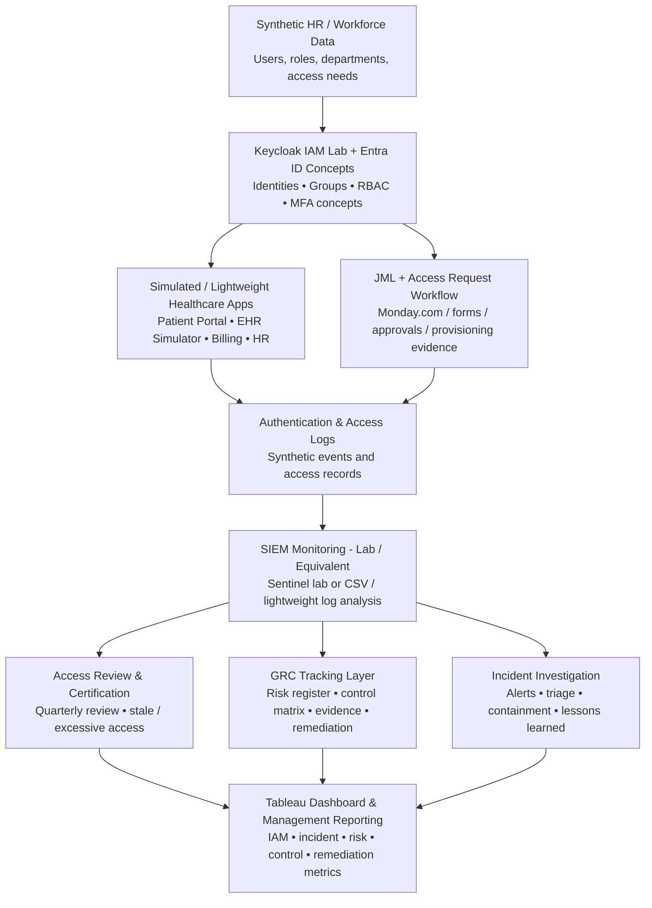

# Project Design Documentation

**Last updated:** August 11th, 2026

---

## 1. Project Title & Version Control

**Project Title:** Care Access Navigator | IAM + GRC Healthcare Cybersecurity Capstone

**Version:** v1.1

**Date:** 08/11/2026

**Change Log:** Revised tool stack and architecture diagram to use Tableau and practical 12-week simulation/equivalent components.

---

## 2. Project Summary

Care Access Navigator is a simulated healthcare cybersecurity environment that combines Identity and Access Management (IAM) with Governance, Risk and Compliance (GRC) to protect simulated electronic Protected Health Information (ePHI). The project demonstrates identity lifecycle management, RBAC, least privilege, access reviews, security monitoring, incident handling, risk assessment, control mapping, evidence collection, and reporting using synthetic data.

---

## 3. Problem Statement / Use Case

Healthcare organizations need to ensure that workforce users receive only the access required for their job responsibilities, that access is removed when it is no longer needed, and that unusual access activity can be investigated. Care Access Navigator addresses this need through a simulated healthcare environment that demonstrates IAM governance, security monitoring, risk management, and control evidence without using real patient data or production healthcare systems.

The intended users and stakeholders are IAM analysts, security analysts, GRC analysts, department managers, HR/workforce administrators, and other personnel responsible for requesting, approving, administering, reviewing, and monitoring access.

---

## 4. Goals and Objectives

Demonstrate role-based access control, least privilege, and identity governance for a simulated healthcare workforce using synthetic identities and applications.

- Implement and test joiner-mover-leaver (JML), access-request, approval, privileged-access, and periodic access-review workflows.
- Generate and investigate simulated authentication and access anomalies, document an end-to-end incident response, and connect findings to risks, controls, remediation, and management reporting.

---

## 5. Key Features / Functions

Synthetic healthcare workforce identities and events using non-production data only.

- RBAC and least-privilege model for Clinician, Nurse, Billing, HR, IT Support, Security Analyst, and Vendor roles.
- Joiner-Mover-Leaver lifecycle workflows covering provisioning, role changes, deprovisioning, and access verification.
- Access-request and approval workflow with business justification, manager approval, IAM/security validation, provisioning evidence, and access verification.
- Periodic access-review process that identifies excessive, stale, mismatched, privileged, or expired access and creates remediation actions.
- Security-event logging and simulated monitoring use cases including repeated failed logins, disabled-user activity, privilege escalation, excessive ePHI access, and expired vendor access.
- Risk register, control matrix, evidence index, gap assessment, exceptions, remediation tracking, and control testing.
- GRC dashboard/reporting combining IAM, incident, risk, control, access-review, and remediation metrics.
- Break-glass/emergency-access concept and governance controls for exceptional access scenarios.

---

## 6. Tech Stack and Tools

**Identity provider:** Keycloak — provides the primary identity-provider lab for users, groups, roles, authentication, and access workflows; Microsoft Entra ID concepts or lightweight lab integration may be demonstrated where feasible.

- **Applications:** Simulated Patient Portal, EHR Simulator, Billing App, and HR App — these may be shown as lightweight mock applications, simple interfaces, or sample datasets rather than fully built enterprise systems.
- **Data:** Synthetic identities, access records, application events, authentication logs, risk records, control evidence, and other non-production project data.
- **Automation:** Python is optional for simple data generation, log parsing, workflow support, and reporting automation; IAM workflows may also be implemented directly in the identity-provider lab.
- **Data analysis and reporting:** Excel/CSV analysis, Tableau dashboards, and optional Python/pandas for reviewing access, logs, risks, and reporting data.
- **Security monitoring:** Microsoft Sentinel lab or an equivalent lightweight SIEM/log-analysis simulation using sample or CSV logs, depending on feasibility within 12 weeks.
- **Project/GRC tracking:** Monday.com for tasks, evidence, status, risks, controls, and remediation tracking.
- **Documentation:** Microsoft Word and Excel for procedures, policies, risk register, control matrix, evidence index, test results, and reporting.
- **Architecture and workflows:** Lucidchart for IAM/GRC architecture, access lifecycle, incident, and data-flow diagrams.
- **Version control:** GitHub for portfolio versioning of sanitized documentation and configuration artifacts.

---

## 7. Architecture / Workflow Diagram

**High-level architecture and process flow:**

*Scope kept practical for 12 weeks: enterprise tools may be shown through simulation, lab setup, or lightweight equivalents.*

**Flow summary:** Workforce identities → Keycloak / Entra ID concepts → Groups and RBAC roles → Simulated/lightweight healthcare applications and JML/access-request workflows → Authentication and access logs → SIEM monitoring and investigation → Access reviews, incident investigation, and GRC risk/control/evidence tracking → Tableau dashboard and management reporting.

The design is intentionally simulated and uses synthetic identities, synthetic events, and non-production data. To keep the project achievable within 12 weeks, components that are impractical to build fully are represented through lab configurations, mock applications, sample datasets, screenshots, or lightweight equivalent tools.

---

## 8. Timeline / Weekly Milestones

Use this section to plan how the project moves through the software development life cycle (SDLC) over 12 weeks. Adjust specific tasks to fit the project while keeping the overall progression from planning through release.

| Week | Project Outcome | SDLC Stage / Focus Area |
|---|---|---|
| Week 1 | Define scenario, scope, stakeholders, requirements, assets, and success criteria for the simulated healthcare environment. | Planning / Health Scenario Setup |
| Week 2 | Set up the project workspace and IAM lab; configure Keycloak, document Entra ID concepts, establish applications, users/groups, and the logging foundation. | Foundation / Infrastructure Setup |
| Week 3 | Design IAM architecture and RBAC; define roles, permissions, least privilege, and the access-request/approval workflow; implement and test representative access. | IAM Architecture & RBAC |
| Week 4 | Implement joiner, mover, and leaver workflows and perform a sample periodic access review. | Identity Lifecycle Management |
| Week 5 | Document authentication controls, MFA expectations, privileged roles, service/vendor identities, and test privileged-access scenarios. | Authentication & Privileged Access |
| Week 6 | Define SIEM monitoring use cases, generate/collect safe simulated events, create detections, and establish alert-triage procedures. | SIEM & Security Monitoring |
| Week 7 | Simulate a suspicious ePHI-related access incident, investigate events, contain the simulated account, preserve evidence, and document lessons learned. | Incident Detection & Response |
| Week 8 | Define risk methodology, identify IAM/security risks, score risks, and create treatment plans. | GRC Risk Assessment |
| Week 9 | Create the control inventory and map relevant controls to HIPAA Security Rule concepts and NIST framework/control concepts; perform a gap assessment. | Controls & Compliance Mapping |
| Week 10 | Organize evidence, perform sample control tests, document exceptions, and track corrective actions. | Evidence, Exceptions & Remediation |
| Week 11 | Define and integrate IAM, incident, risk, control, access-review, and remediation metrics into a management dashboard/report. | GRC Dashboard & Reporting |
| Week 12 | Execute end-to-end testing, finalize portfolio documentation and evidence, prepare the 5-minute demo, and present results and lessons learned. | Testing, Documentation & Presentation |

---

## 9. Risks and Risk Mitigation

- **Scope risk** — Keep the project limited to the defined simulated healthcare environment, seven representative roles, controlled use cases, and the 12-week schedule.
- **Tooling complexity** — Use Keycloak as the primary IAM lab, Microsoft Sentinel or an equivalent lightweight monitoring approach, Tableau for final reporting, and simple documentation/tracking tools rather than attempting a full enterprise deployment.
- **Synthetic data quality** — Use repeatable templates and controlled synthetic identities/events; do not use real patient information or production data.
- **Incomplete or weak evidence** — Maintain an evidence index linking screenshots, logs, access reviews, tickets, approvals, test cases, and diagrams to controls and risks.
- **Requirements or implementation gaps** — Review scope and requirements during the project and track identified gaps through the risk register, exceptions, and remediation process.

---

## 10. Evaluation Criteria

- **IAM success:** Demonstrate at least one complete JML workflow, an RBAC matrix, an access-request workflow, and a periodic access-review demonstration.
- **Monitoring and incident success:** Demonstrate at least three useful detection use cases with controlled test events and analyst investigation evidence, plus one end-to-end simulated access incident.
- **GRC success:** Complete a risk register, control matrix, evidence index, gap assessment, exceptions/remediation tracking, and a management dashboard or summary report.
- **Portfolio success:** Produce presentation-ready architecture, workflows, procedures, test cases, screenshots/evidence, reporting outputs, and a concise 5-minute demonstration within the 12-week project period.

---

## 11. Future Considerations

Expand the simulated workforce, application set, and role coverage after the MVP is complete.

- Replace or supplement simulated/SIEM log analysis with a more advanced enterprise monitoring platform in a future version.
- Add additional incident simulations, deeper IAM automation, privileged-access controls, and broader compliance/control mappings.
- Build a self-service access-request portal and integrate additional identity governance capabilities in a future release.

---

*Version 1.0 | Copyright © 2025 dae. All Rights Reserved*
